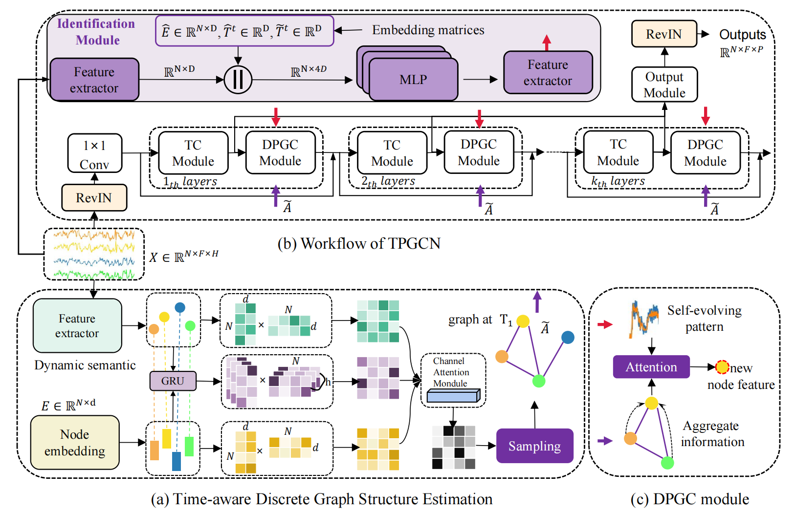

# TPGCN
The official implementation of Time-aware Personalized Graph Convolutional Network for Multivariate Time Series Forecasting.

# TPGCN- Official PyTorch Implementation
The official implementation of Time-aware Personalized Graph Convolutional Network for Multivariate Time Series Forecasting. ([paper](https://doi.org/10.1016/j.eswa.2023.122471)).  



## Requirements
- python 3
- see `requirements.txt`

## Data Preparation
Raw Dataset

Traffic data  [https://github.com/LeiBAI/AGCRN](https://github.com/guoshnBJTU/ASTGNN)

Time series data https://github.com/laiguokun/multivariate-time-series-data


## Train Commands

For traffic datasets (PeMSD3, PeMSD4, PeMSD7, PeMSD8):

python Pems4/train_pems.py --gcn_bool  --dataset

For time series datasets:

python Time_series/train_series.py --gcn_bool  --dataset

## Experimental result
[I uploaded the model's training log on the PeMSD8 dataset](https://github.com/ZhuoLinLi-shu/TPGCN/tree/main/Pems4/log)

## Citing

If you find this repository useful for your work, please consider citing it as follows:

```bibtex
@article{li2024time,
  title={Time-aware personalized graph convolutional network for multivariate time series forecasting},
  author={Li, ZhuoLin and Gao, ZiHeng and Zhang, XiaoLin and Zhang, GaoWei and Xu, LingYu},
  journal={Expert Systems with Applications},
  volume={240},
  pages={122471},
  year={2024},
  url={https://doi.org/10.1016/j.eswa.2023.122471},
  doi={10.1016/j.eswa.2023.122471},
  timestamp={Mon, 15 April 2024},
  publisher={Elsevier}
}
```

